Cloud Artist Platform
Production-Grade Serverless AI Intelligence System on AWS
Executive Summary
The Cloud Artist Platform is a high-performance, event-driven AI system designed to automate visual intelligence for digital art management. By leveraging a decoupled, serverless architecture, the system transforms raw image uploads into structured metadata using Amazon Rekognition, serving the results via a globally optimized RESTful API to an interactive, frontend dashboard. This project demonstrates end-to-end product delivery, alongside proficiency in Infrastructure as Code (Terraform), secure cloud networking (VPC/IAM), and containerized DevOps tooling (Docker).
---------------------------------------------------------------------------------------------------------------------

Architecture Diagram (High-Level Flow)
The Cloud Artist Platform follows a fully serverless, event-driven architecture designed for scalability, security, and low operational overhead.
End-to-End Data Flow
User Upload (Frontend)
        ↓
Amazon S3 (Image Storage)
        ↓ (S3 Event Trigger)
AWS Lambda (ArtProcessor Function)
        ↓
Amazon Rekognition (Image Analysis)
        ↓
Amazon DynamoDB (Metadata Storage)
        ↓
API Gateway (RESTful Access Layer)
        ↓
Frontend Dashboard (CloudFront + S3)

--------------------------------------------------------------------------------------------------------------------

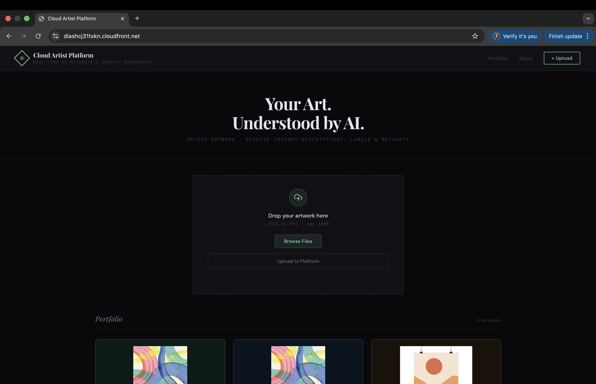
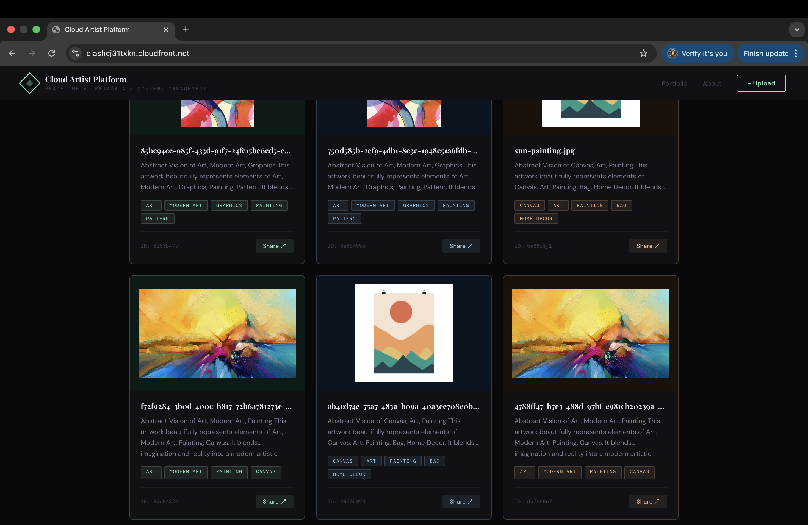
Fig 1: The 'Cloud Artist Platform' live dashboard, demonstrating end-to-end integration of the AI pipeline.
---------------------------------------------------------------------------------------------------------------------
System Architecture
The platform utilizes a modern, serverless tech stack to ensure scalability and cost-efficiency. The entire infrastructure is provisioned through Terraform, ensuring environment parity and easy teardown.
Frontend: Static dashboard (HTML/JS) hosted on S3 and distributed via CloudFront.
Compute: Event-driven AWS Lambda functions for image processing and data retrieval.
Database: Amazon DynamoDB (Table: artwork_metadata) for low-latency NoSQL storage.
AI Layer: Amazon Rekognition for automated object detection and visual labeling.
Networking: Custom VPC with public/private subnets and an EC2 Bastion Host for secure administration.

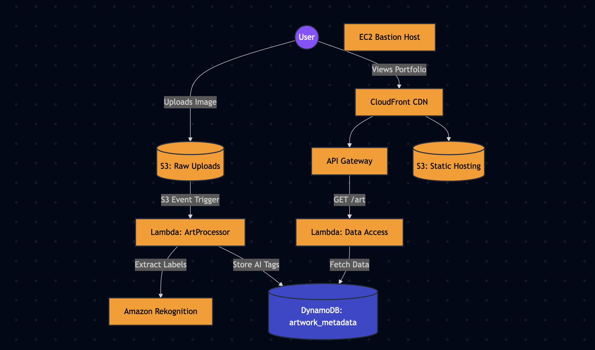
Fig 2: Visual mapping of the custom VPC, showcasing isolated subnets and secure routing logic.
Phase 1: Security & Cost Governance
Operating with a 'Security First' mindset, the project emphasizes administrative best practices and proactive cost management.

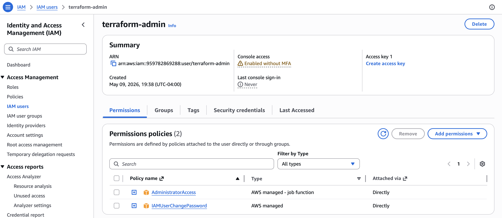
Fig 3: Adhering to the Principle of Least Privilege by operating through a scoped Admin IAM user.

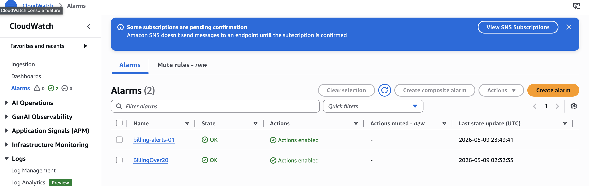
Fig 4: Proactive cost monitoring to ensure infrastructure remains within the AWS Free Tier and budget limits.
Phase 2: Infrastructure as Code (Terraform)
Infrastructure is treated as a software product. All resources are defined in Terraform configuration files, allowing for automated provisioning and 'State' management.

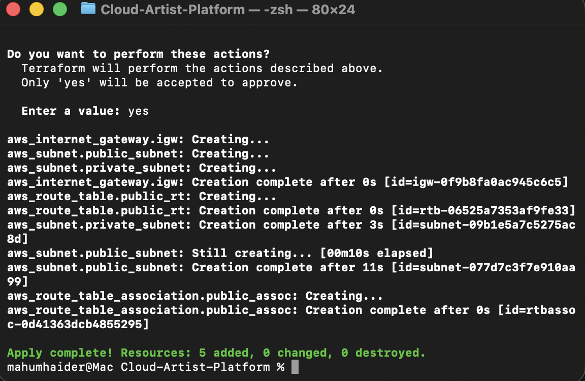
Fig 5: Terminal output confirming the successful creation of all networking and serverless resources.

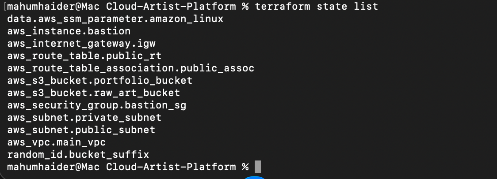
Fig 6: Verifying managed resources via the CLI to ensure state consistency across the cloud environment.
Phase 3: Compute & Storage Foundation
The application lives in a hardened network. Public-facing assets are isolated from private-tier data storage.
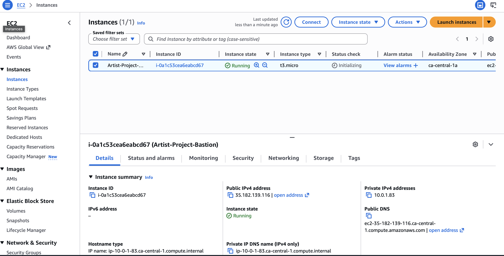
Fig 7: Terraform-provisioned Bastion Host used for secure SSH administration within the VPC.

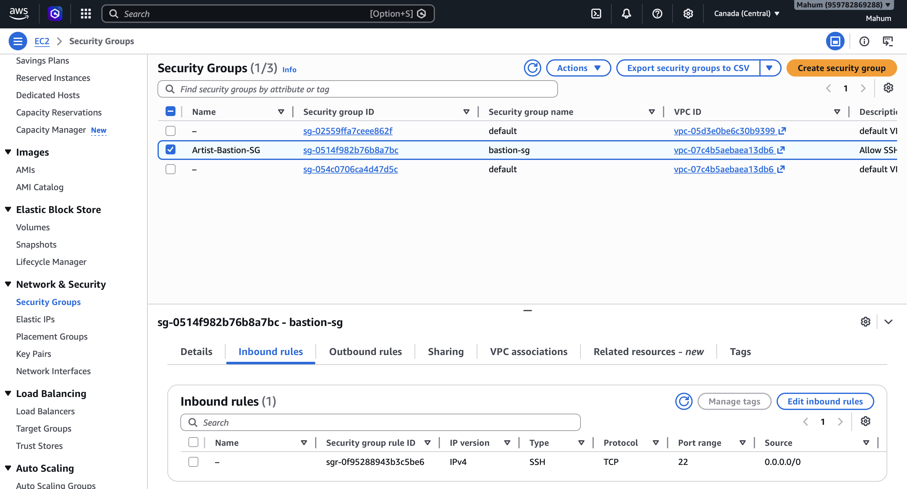
Fig 8: Security proof showing the Bastion Host is locked down to a single administrative IP address.

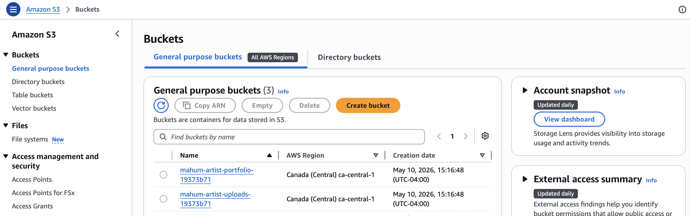
Fig 9: Managed storage buckets for raw art uploads and static portfolio website hosting.
Phase 4: Event-Driven AI Intelligence
The 'brain' of the platform is a decoupled processing pipeline. An image upload triggers an asynchronous analysis workflow, extracting visual metadata without blocking the user interface.

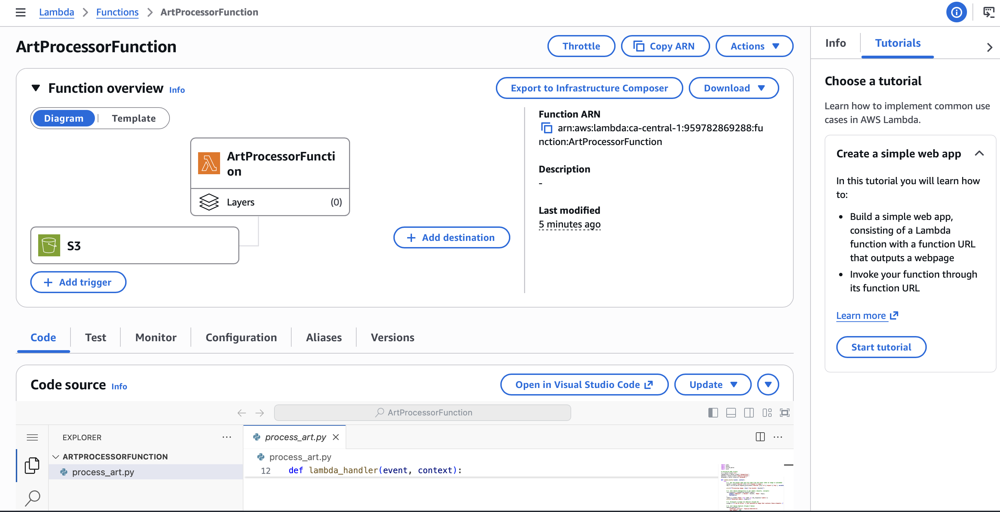
Fig 10: Event notification setup invoking the 'ArtProcessor' Lambda function on S3:ObjectCreated events.

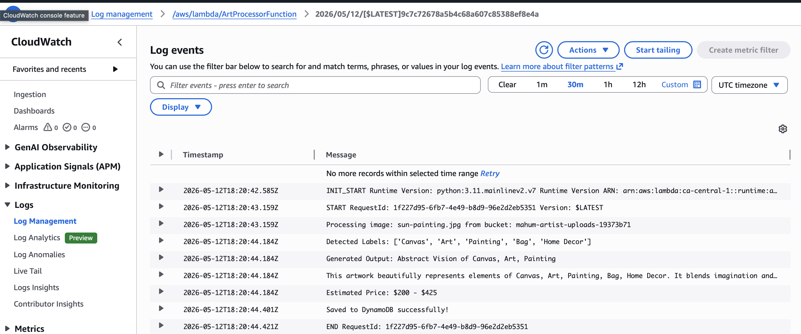
Fig 11: Real-time logs proving the AI successfully identified labels like 'Canvas', 'Abstract', and 'Modern Art'.

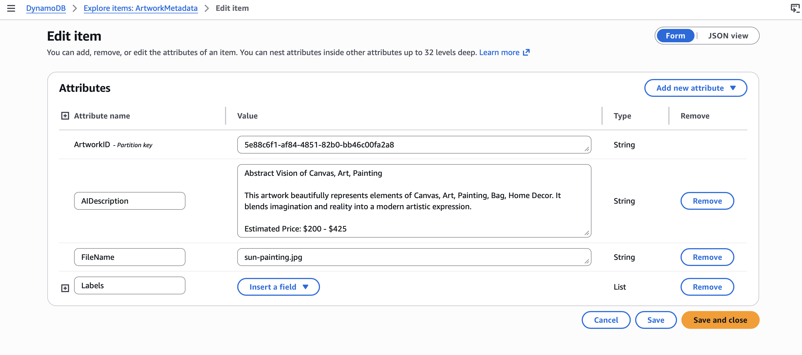
Fig 12: Data persistence validation, showing structured AI tags stored safely in the NoSQL database.
Phase 5: RESTful API & CDN Delivery
Data is served through a secure API Gateway, while the frontend is accelerated via a global Content Delivery Network.

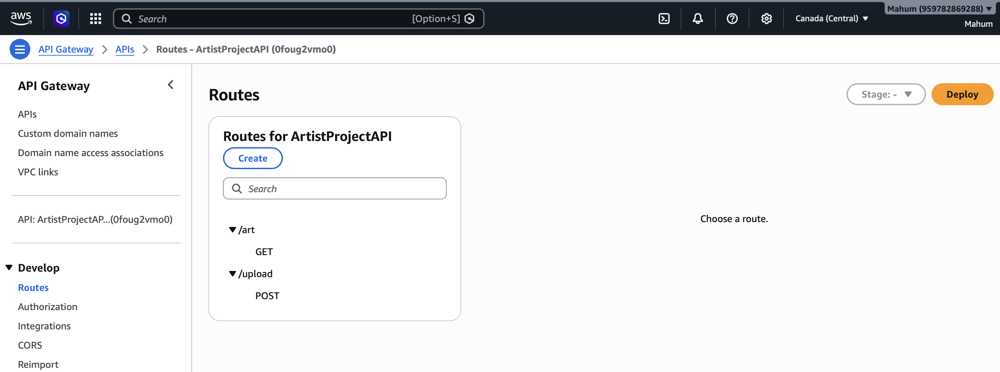
Fig 13: Designed API contract for uploading artwork and retrieving AI-processed metadata.
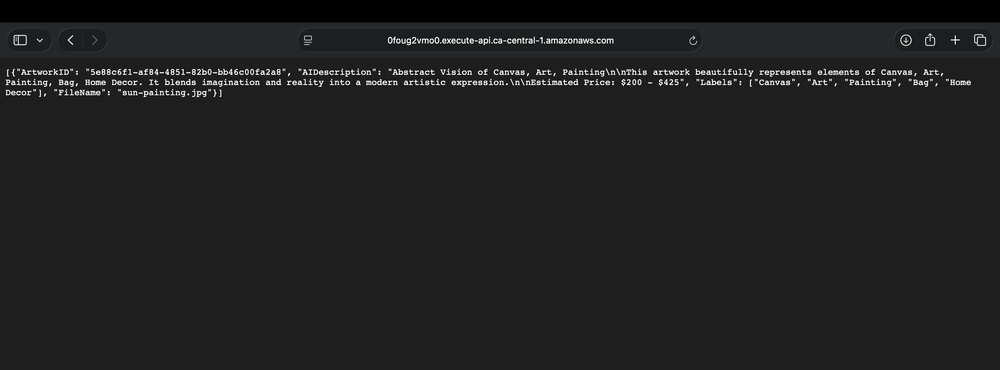
Fig 14: Validating the 'Request-Response' cycle. The structured JSON output is ready for frontend consumption.

Fig 15: Security and performance. CloudFront distribution providing global SSL/TLS encryption.
Interactive UI & Sharing: Built a CloudFront-delivered frontend that displays the AI portfolio and uses the native Web Share API to let users instantly distribute their artwork and metadata.
Phase 6: DevOps & Auditing (Docker)
To ensure environment parity and eliminate local dependency conflicts, I developed a containerized administrative auditing tool. This tool automates the validation of S3 storage consistency against DynamoDB records.
Technical Highlight: The Dockerized tool successfully identified a 1-record discrepancy between S3 and DynamoDB, demonstrating the system's 'self-healing' auditing capabilities.

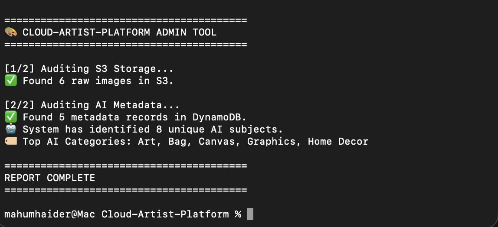
Fig 16: Terminal output of the containerized tool running locally via injected environment variables.
In your README, you could write:
"During local testing, manual library management led to dependency errors. To ensure environment parity and eliminate the 'works on my machine' problem, I containerized the Admin Tool using Docker, automating the installation of all necessary Python dependencies (Boto3) within the image."
---------------------------------------------------------------------------------------------------------------------
Skills Demonstrated & Impact
Serverless Architecture (AWS Lambda, API Gateway)
Infrastructure as Code (Terraform)
AI/ML Computer Vision (Rekognition)
Network Security (VPC, IAM, Bastion, CloudFront)
Containerized DevOps (Docker)
Observability (CloudWatch)
Frontend Integration (Tailwind CSS, Native Web Share API, Async JS)

Impact: Successfully converted a manual gallery management process into a high-speed, automated AI pipeline, reducing metadata generation time to sub-second levels while maintaining strict cost and security governance.

